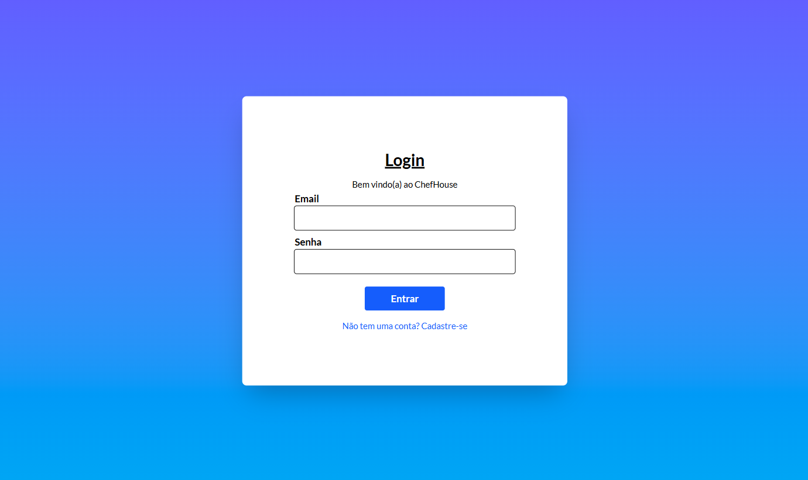
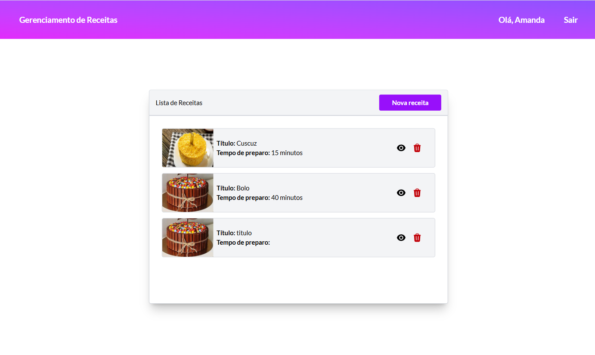

# ChefHouse

CRUD gerenciamento de receitas

- [x] Python
- [x] React
- [x] TypeScript
- [x] APIs REST
- [x] Banco de Dados PostgreSQL
- [x] Amazon AWS 
- [x] Git

Verifique aqui mais informações sobre a [api](./backend/README.md)

Verifique aqui mais informações sobre o [frontend](./frontend/README.md)